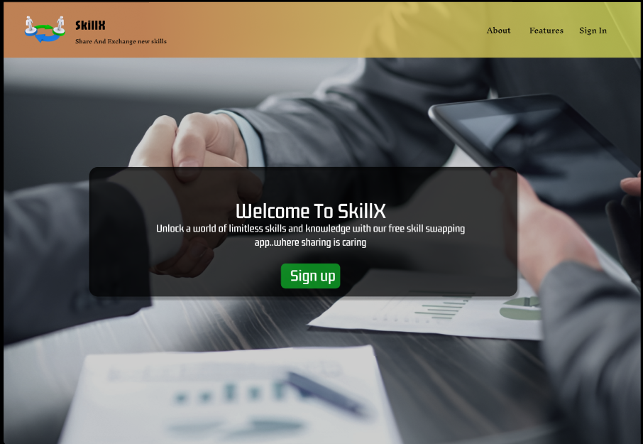
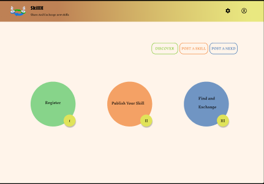
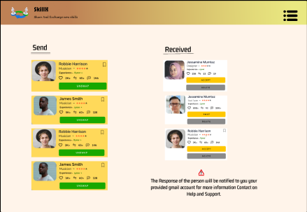

# 🎨 SkillX – UI/UX Design for Skill Exchange Platform

This repository contains the UI/UX design for **SkillX**, a skill exchange platform showcased at the **Product Expo**.

## 🔗 Figma Design Link
[🔗 View the SkillX Design on Figma](https://www.figma.com/design/bfYQSe6ZI3Y08YRRGx271D/product_expo?node-id=0-1&t=RGYAK06qtLhwzm1Y-1)

## 🧠 Project Summary

**SkillX** is a platform where individuals can **connect, share, and trade skills** seamlessly. The platform encourages peer-to-peer learning through secure profiles and smart skill-matching features.

> ✅ Designed an intuitive and clean interface  
> 🔐 Emphasis on secure profiles  
> 🤝 Built for collaboration and skill discovery  
> 📱 Responsive and mobile-friendly layout (if applicable)

## 📸 Screenshots

Here are some key screens from the **SkillX** UI design:

| Landing Page |
|--------------|
|  | 

| Home Page |
|--------------|
 | 

| Info Page |
|--------------|
 |

## 📁 Files Included
- `screenshots/` – PNG/JPG images of Figma frames  
- `product_expo.pdf` – Exported PDF of full design

## 🛠️ Tools Used
- **Figma** for design, components, prototyping
- Auto Layout, Components, Variants

## 📚 Use Case
This design can be used for:
- Frontend development references
- UI/UX case study
- Design system inspiration
- Startup pitch demos

---

Made with ❤️ using [Figma](https://www.figma.com)
